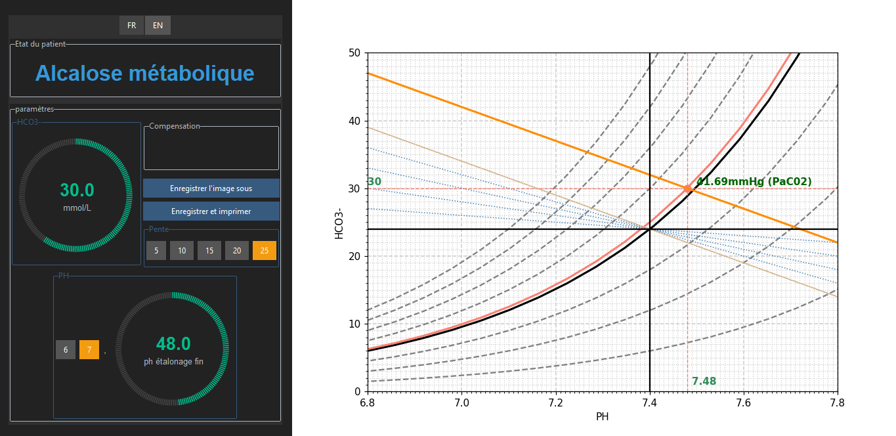

# Davenport-InterractiveDiagramm

This is an interractive davenport diagramm, it can be used for learning purposes of the human ph equilibration, or as a tool to quickly capture the acidobasis-state of a  patient

.py is curently stable, 

.exe V1 is released!

